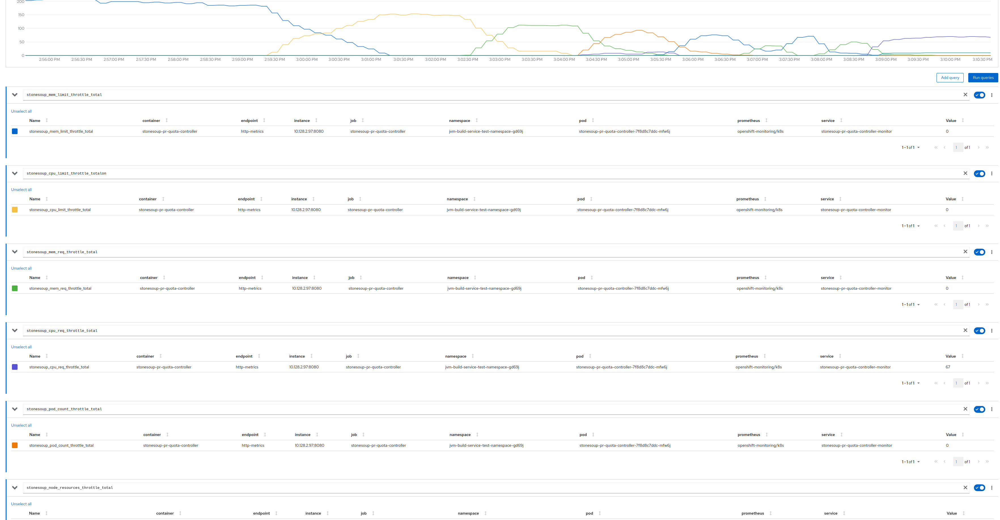
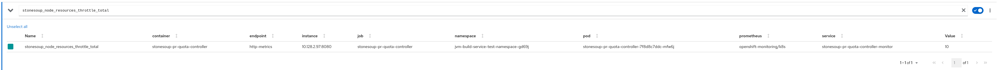

# pipeline-quota-controller

A controller for compiling metrics related to the impact of either k8s or openshift quota on the scheduling 
of `PipelineRun` underlying container by k8s.

Parsing the events generated by the kubelet when it refrains from starting work because of quota is at the core
of generating these metrics.

This POC first watched events directly, worried about the latency in `Pod` conditions translating into `TaskRun`
conditions translating into `PipelineRun` conditions.  However, a) the latency was tolerable during testing, b) reconciling events
along with changing `PipelineRun` state with respect to throttling lead to FSM based complexities.  The Events controller is still in the repo
for now, but will most likely be removed.  Using the `PipelineRun` as a single "source of truth" with respect whether 
is is throttled by quota is the best path, given the latency for the `PipelineRun` being noted as throttled again appears 
acceptable.

Reconcilers are in place for the various quota types.  Future work there could include:

- Based on a CRD based configuration / policy, dynamically adjust quota for a namespace when limits are hit
- Expose the information kept in quota status around current state in the namespace vs. the quota limits

The metrics "configuration" certainly needs evolution for official incorporation into RHTAP / Placement Service:

- names/types/labels of metrics should be vetted
- moving from integration into OCP's console's monitoring dashboard to a separate Grafana dashboard, like we are doing with other metrics
- alerts, though IMO these should be tuneable via an operator CRD instance, and created by the controller, vs. being simple yaml

## Some early screen shots

This initial screen shot shows about a 15 minute window of the jvm-build-service analyzing Service Registry.  Hundreds of
`PipelineRun` are created as a result.  The are all ultimately throttle by the default sandbox ResourceQuota around
- memory limit
- cpu limit
- memory request
- cpu request
- pod count

However, the kubelet does not necessarily cite all vectors when initially throttling.  As such, throttling only gets recorded 
for memory limit initially.  Then, as the `ResourceQuota` around memory limits is relaxed, we start seeing throttling go down 
for memory limit, but rise for cpu limit.  Each of the 5 `ResourceQuota` items were manually updated, relaxing the contraint,
until we were able to max out the resources on nodes in the cluster

In which case our exceeded node resources metric started increasing:

